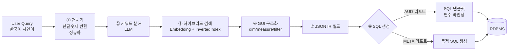

# G-MATRIX · 엔터프라이즈 한국어 Text-to-SQL 엔진

> 자연어 질문으로 BI 리포트를 자동 생성하는 폐쇄망 환경용 RAG 기반 Text-to-SQL 엔진

**작성자** 박영상
**프로젝트 유형** 회사 프로덕트 · 백엔드/AI 파이프라인 설계 및 구현
**기술 스택** `Python` `FastAPI` `SentenceTransformer` `FAISS` `vLLM` `Pickle Cache` `Uvicorn`

---

## 📌 한 줄 소개

비개발자가 한국어로 "작년 3분기 서울지역 매출 Top 10" 같이 질문하면, 사내 BI 리포트 구조에 맞춰 자동으로 SQL을 생성·실행해 결과를 반환하는 **엔터프라이즈 Text-to-SQL 엔진**입니다.

단순히 GPT API에 스키마를 넘기는 구조가 아니라, **폐쇄망 온프레미스 LLM + 하이브리드 RAG + JSON 중간표현(IR) 기반 SQL 생성** 파이프라인을 직접 설계·구현했습니다.

---

## 🎯 문제 정의 (Why)

### 배경
기존 BI 리포트 조회는 사용자가 수십 개의 필터·차원·측정값을 직접 조작해야 했고, 이는 데이터 기반 의사결정의 명확한 병목이었습니다. 비개발자 사용자(경영진, 현업)는 매번 개발자에게 리포트 요청을 해야 했습니다.

### 왜 "GPT API + 스키마"로는 안 되는가
단순 LLM 호출 방식은 아래 4가지 이유로 엔터프라이즈 환경에 적용 불가했습니다.

| # | 제약 | 설명 |
|---|---|---|
| 1 | 🔒 **폐쇄망/보안** | 외부 API 호출이 금지된 고객사 다수. 온프레미스 LLM 서빙 필수 |
| 2 | 🗣 **한국어 + 도메인 약어** | "SD매출", "AUD500", "삼십만원" 등 순수 임베딩으로는 매칭 실패 |
| 3 | 📚 **레거시 자산** | 수년간 축적된 AUD 리포트 SQL 템플릿을 재활용해야 안정성 확보 가능 |
| 4 | 🎯 **정확도** | 잘못된 SQL은 경영 의사결정에 직결 — 검증 가능한 구조 필요 |

---

## 🏗 아키텍처



### 컴포넌트 구성
```
gmatrixsvc.py           # 엔트리포인트 (uvicorn, :8000)
payload.py              # FastAPI 앱 · 라우터 · 파이프라인 초기화
controller/             # HTTP API 레이어
core/
  ├─ utils.py           # 질의 전처리 · 키워드 추출
  ├─ converter.py       # 한글 숫자 → 아라비아 변환
  ├─ data_retrieval.py  # 검색 오케스트레이터
  ├─ vectordb.py        # 타입별 유사도 검색
  ├─ vector/
  │   ├─ vectorstore.py # 하이브리드 검색 (Embedding + InvertedIndex)
  │   ├─ embedding.py   # SentenceTransformer + Pickle 캐시
  │   └─ document.py    # 메타 문서 로더
  ├─ gui.py             # 검색결과 → dim/measure/filter 정규화
  ├─ jsonbuilder.py     # LLM 응답 → JSON IR
  ├─ metasql.py         # JSON IR → SQL (Dual 경로)
  └─ prompt_helper.py   # LLM 호출 (self-hosted vLLM)
pipeline/               # 벡터스토어 · 임베딩 캐시 초기화
datastore/              # 메타필드 · 힌트 · 용어 문서 + 임베딩 캐시
```

---

## 💡 핵심 기술 결정 (Trade-off)

### 1. 왜 하이브리드 검색인가? 🔍

**문제**: 순수 벡터(임베딩) 검색은 `"SD매출"`, `"AUD500코드"` 같은 **도메인 약어·코드**에 취약했습니다. 의미적으로 유사한 엉뚱한 필드로 매칭되는 사례가 다수 발생.

**해결**: `GMatrixVectorStore`를 **Embedding + InvertedIndex 하이브리드** 구조로 설계
- **Embedding 경로**: `bi-matrix/G-MATRIX-embedding-v1` (사내 파인튜닝 모델) 으로 의미 기반 검색
- **InvertedIndex 경로**: 부분문자열 기반 정확 매칭으로 약어/코드 보완
- 두 경로의 결과를 reportcode 필터와 함께 병합·랭킹

**효과**: 한국어 도메인 약어에 대한 검색 실패 케이스를 크게 줄이고, "잘못된 SQL 생성"의 근본 원인 중 하나를 차단.

---

### 2. 왜 JSON 중간표현(IR)을 거치는가? 📐

**대안 A (기각)**: LLM이 SQL을 직접 생성
→ 검증 어려움, 멀티뷰 merge 불가, 레거시 리포트 엔진과 호환 안 됨

**대안 B (채택)**: LLM은 `{dimension, measure, filter, mergeType, reportcode}` 형태의 **JSON IR**만 생성하고, SQL 생성은 결정론적 빌더가 담당

```json
{
  "reportcode": "SALES_001",
  "dimension": ["region", "quarter"],
  "measure": [{"field": "sales_amt", "agg": "SUM"}],
  "filter": {"op": "AND", "conds": [...]},
  "mergeType": "UNION"
}
```

**이점**
- ✅ **검증 가능**: JSON 스키마 단계에서 유효성 체크 가능
- ✅ **멀티뷰 지원**: `mergeType`으로 UNION/INTERSECTION 조합
- ✅ **레거시 호환**: 기존 BI 엔진의 리포트 정의와 1:1 매핑
- ✅ **디버깅 용이**: LLM 오류와 SQL 생성 오류를 분리해서 추적 가능

---

### 3. 왜 Dual SQL 경로인가? ⚙️

수년간 축적된 리포트 자산을 버릴 수 없었습니다. 그래서 리포트 타입에 따라 경로를 분기:

| 경로 | 대상 | 방식 | 장점 |
|---|---|---|---|
| **AUD 템플릿 바인딩** | 기존 AUD 리포트 | 사전 정의 SQL + JSON filter 값 바인딩 | 검증된 SQL, 안정성 |
| **META 동적 생성** | 신규/범용 질의 | JSON IR → SELECT/FROM/WHERE 동적 구성 | 유연성, 확장성 |

`METASQLBuilder` 생성자에서 리포트 코드를 보고 자동 라우팅하도록 설계 — **레거시 자산 재활용과 신규 질의 대응을 양립**시킨 핵심 포인트입니다.

---

### 4. 한국어 특화 전처리 🇰🇷

`TextConverter` 클래스로 한국어 수사·단위 표현을 아라비아 숫자로 변환:

```
"작년 삼십만원 이상 주문"  →  "작년 300000원 이상 주문"
"매출 1억 2천만"            →  "매출 120000000"
```

이 한 단계만으로도 filter 값 매칭율이 크게 개선되었습니다. 한국어 도메인에서 임베딩만 믿지 않고 **규칙 기반 전처리**를 적극 도입한 것이 현실적인 선택이었습니다.

---

### 5. 콜드스타트 최소화 — 임베딩 Pickle 캐시

메타필드·용어 수만 건을 매번 임베딩하면 서비스 재기동마다 수 분 단위 지연 발생.
→ `EmbeddingCache`가 `datastore/embeding_cache.pkl`에 영속화, 재기동 시 로드만 수행. 신규 문서만 incremental embedding.

---

## 🧠 LLM 서빙 전략

- **LLM 타입 3종 지원** (`LLM_TYPE` 설정으로 스위칭)
  1. 로컬 transformer 직접 로드
  2. OpenAI / Claude API (`CustomLLMClient`)
  3. **사내 vLLM 기반 OpenAI 호환 엔드포인트** (기본값, 폐쇄망 환경)
- `temperature=0`, `seed=0` 고정 — Text-to-SQL의 결정성 확보
- 프롬프트는 `prompt.py`의 `GMATRIX_PROMPT_TEMPLATES` 사전에 중앙화 (질의 분해 / 의도 분류 / JSON 교정 / 엔티티 추출 등 태스크별 템플릿)

---

## 📊 주요 기여

본 프로젝트에서 제가 설계·구현한 영역:

- [x] **전체 파이프라인 아키텍처 설계** (전처리 → 검색 → IR → SQL 생성)
- [x] **하이브리드 벡터 검색 모듈** (`vectorstore.py`, `embedding.py`)
- [x] **JSON IR 스키마 및 빌더** (`jsonbuilder.py`)
- [x] **Dual 경로 SQL 생성기** (`metasql.py`)
- [x] **한국어 전처리 / 숫자 변환기** (`converter.py`, `utils.py`)
- [x] **LLM 프롬프트 템플릿 설계 및 튜닝** (`prompt.py`)
- [x] **FastAPI 기반 API 레이어** (`controller/`, `payload.py`)

---

## 🔍 회고

### 가장 어려웠던 문제
초기에는 순수 임베딩 검색만으로 설계했으나, 한국어 도메인 약어(`SD`, `AUD500` 등)에서 엉뚱한 필드로 매칭되는 이슈가 반복 발생했습니다. 사용자 입장에서는 "AI가 이상한 답을 준다"는 불신으로 이어졌습니다.

- **Situation**: 임베딩 기반 검색의 한국어 약어 매칭 실패
- **Task**: 의미 검색의 장점을 유지하면서 정확 매칭 보강
- **Action**: `InvertedIndex` 병행 설계, 전처리 파이프라인(약어 사전·한글 숫자 변환) 재구성, 프롬프트에 few-shot 보강
- **Result**: 잘못된 SQL 생성 빈도 유의미하게 감소, 사용자 재질의율 개선

### 한계와 향후 개선
- 복잡한 다중 JOIN·서브쿼리 질의는 현재 JSON IR로 표현 어려움 → **Agent 기반 self-correction** (LangGraph) 도입 검토
- 대화형 follow-up 질의 미지원 → 세션 컨텍스트 관리 필요
- 품질 모니터링 체계 부재 → **Langfuse / MLflow** 도입으로 질의-응답-피드백 로그 파이프라인 구축 필요
- 평가셋 자동화 — 회귀 테스트용 질의/정답 SQL 쌍 관리

### 배운 점
- **"LLM을 어디까지 믿을 것인가"** 의 경계선을 긋는 것이 설계의 핵심이었습니다. LLM은 비결정적인 "이해" 영역에, 결정론적 빌더는 SQL 생성 영역에 두는 분리가 유지보수성과 정확도를 모두 끌어올렸습니다.
- 순수 벡터 검색의 한계를 실제 프로덕션 환경에서 체감하고, **하이브리드 검색**의 실효성을 확인한 경험.
- 엔터프라이즈 환경에서는 **최신 기술보다 레거시 호환성**이 프로젝트의 성패를 가른다는 현실적 교훈.

---

## 🛠 기술 스택 상세

| 영역 | 사용 기술 |
|---|---|
| **언어/프레임워크** | Python 3.11, FastAPI, Uvicorn, Starlette |
| **LLM / 임베딩** | vLLM (self-hosted), SentenceTransformer, `bi-matrix/G-MATRIX-embedding-v1` |
| **벡터 검색** | 자체 구현 하이브리드 (Embedding + InvertedIndex), FAISS |
| **데이터** | Pandas, NumPy, Pickle 기반 캐시 |
| **설정/운영** | JSON config, File Observer 패턴, 구조화 로깅 |

---
